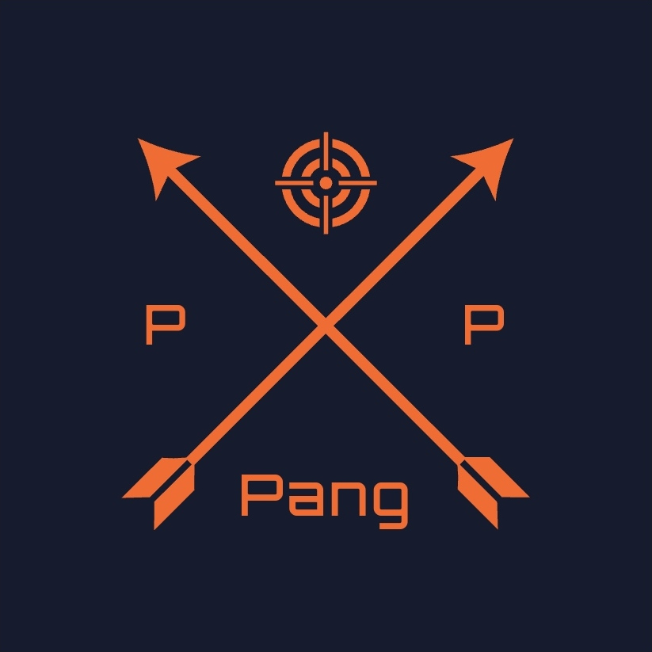
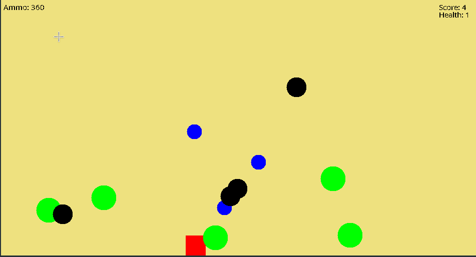

<div id="top"></div>

[![Contributors][contributors-shield]][contributors-url] [![Forks][forks-shield]][forks-url] [![Stargazers][stars-shield]][stars-url] [![Issues][issues-shield]][issues-url] [![MIT License][license-shield]][license-url]


<!-- PROJECT LOGO -->
<br />
<div align="center">
  <a href="https://github.com/dg1asap/Pang">
    
  </a>

  <h3 align="center">Pang</h3>

  <p align="center">
	A 2D arcade platformer
    <br />
    <a href="https://github.com/dg1asap/Pang">
    <br />
    <br />
    <a href="https://www.youtube.com/watch?v=sNvLo3RXLNk&list=PLzLykJmDCNQ-DZczvk51P_f6NFM7-C5KT&index=1">View Demo</a>
    ·
    <a href="https://github.com/dg1asap/Pang/issues">Report Bug</a>
    ·
    <a href="https://github.com/dg1asap/Pang/issues">Request Feature</a>
  </p>
</div>


<!-- TABLE OF CONTENTS -->
<details>
  <summary>Table of Contents</summary>
  <ol>
    <li>
      <a href="#about-the-project">About The Project</a>
      <ul>
        <li><a href="#built-with">Built With</a></li>
      </ul>
    </li>
    <li>
      <a href="#getting-started">Getting Started</a>
      <ul>
        <li><a href="#prerequisites">Prerequisites</a></li>
        <li><a href="#installation">Installation</a></li>
      </ul>
    </li>
    <li><a href="#gameplay">Gameplay</a></li>
    <li><a href="#roadmap">Roadmap</a></li>
    <li><a href="#contributing">Contributing</a></li>
    <li><a href="#license">License</a></li>
    <li><a href="#contact">Contact</a></li>
    <li><a href="#acknowledgments">Acknowledgments</a></li>
  </ol>
</details>


<!-- ABOUT THE PROJECT -->
## About The Project



Pang is a game created by two students of the Warsaw University of Technology as part of the additional course PROZE (Event Programming). The main design assumption was to create a game resembling Pomping World, a game of Japanese origin from 1990 with a network option in the client-server service. Pang is a platformer arcade whose main goal is to avoid and destroy the balls moving on the screen. After passing the level, the score and player's name are displayed in the high score window, where we can compare ourselves with other players.

<p align="right">(<a href="#top">back to top</a>)</p>


### Built With

* [OpenJDK](https://openjdk.java.net)
* [Gradle](https://gradle.org)
* [JUnit5](https://junit.org/junit5/) 


<p align="right">(<a href="#top">back to top</a>)</p>


<!-- GETTING STARTED -->
## Getting Started

### Prerequisites

Download and install the software below
* [OpenJDK](https://openjdk.java.net/install/)

As an IDE, we use IntelliJ IDEA, which I highly recommend
* [IntelliJ IDEA](https://www.jetbrains.com/idea/download/#section=linux)

### Installation

1. Clone the repo
   ```sh
   https://github.com/dg1asap/Pang.git
   ```
2. Open project using IntelliJ, follow [instruction](https://www.jetbrains.com/help/idea/open-close-and-move-projects.html)
3. Compile Pang with the .sh files
	```
	compilePangLinuxMac.sh
	compilePangWindows.sh
	compileServerLinuxMac.sh
	compileServerWindows.sh
	```
5. Run Pang with the .sh files
	```
	runPang.sh
	runSever.sh
	```


<p align="right">(<a href="#top">back to top</a>)</p>


<!-- GAMEPLAY -->
## Gameplay

   

<strong>w</strong> - jump
<strong>a, d</strong> - moving
<strong>k</strong> - shooting
<strong>p</strong> - pause


<p align="right">(<a href="#top">back to top</a>)</p>


<!-- ROADMAP -->
## Roadmap
- [x] Configuring the project with gradle, adding the JUnit5 library for unit tests
- [x] ConfigLoader, GameConfig class and Config.txt file
- [x] Enemy and Player class
- [x] GUI, the main panel of the game
- [x] Composing your own music for the Pang by famous asdewq
- [x] Collision system
- [x] Injury system
- [x] Addition of map boundaries
- [x] GUI, highscore, settings, online, quit, difficulty level panel
- [x] Saving players results to highscore
- [x] Dynamic scaling of the character model and balls with increasing the size of the window
- [x] Option to pause the game
- [x] Online mode in the client-server service
- [x] Game optimalisation

<p align="right">(<a href="#top">back to top</a>)</p>


<!-- CONTRIBUTING -->
## Contributing

Contributions are what make the open source community such an amazing place to learn, inspire, and create. Any contributions you make are **greatly appreciated**.

If you have a suggestion that would make this better, please fork the repo and create a pull request. You can also simply open an issue with the tag "enhancement".
Don't forget to give the project a star! Thanks again!

1. Fork the Project
2. Create your Feature Branch (`git checkout -b feature/AmazingFeature`)
3. Commit your Changes (`git commit -m 'Add some AmazingFeature'`)
4. Push to the Branch (`git push origin feature/AmazingFeature`)
5. Open a Pull Request

<p align="right">(<a href="#top">back to top</a>)</p>


<!-- LICENSE -->
## License

Distributed under the MIT License. See `LICENSE.txt` for more information.

<p align="right">(<a href="#top">back to top</a>)</p>


<!-- CONTACT -->
## Contact

dg1asap - dg_1@wp.pl

Project Link: [https://github.com/dg1asap/Pang](https://github.com/dg1asap/Pang)

<p align="right">(<a href="#top">back to top</a>)</p>


<!-- ACKNOWLEDGMENTS -->
## Acknowledgments

* [Img Shields](https://shields.io)

<p align="right">(<a href="#top">back to top</a>)</p>


<!-- MARKDOWN LINKS & IMAGES -->
<!-- https://www.markdownguide.org/basic-syntax/#reference-style-links -->
[contributors-shield]: https://img.shields.io/github/contributors/dg1asap/Pang.svg?style=for-the-badge
[contributors-url]: https://github.com/dg1asap/Pang/graphs/contributors
[forks-shield]: https://img.shields.io/github/forks/dg1asap/Pang.svg?style=for-the-badge
[forks-url]: https://github.com/dg1asap/Pang/network/members
[stars-shield]: https://img.shields.io/github/stars/dg1asap/Pang.svg?style=for-the-badge
[stars-url]: https://github.com/dg1asap/Pang/stargazers
[issues-shield]: https://img.shields.io/github/issues/dg1asap/Pang.svg?style=for-the-badge
[issues-url]: https://github.com/dg1asap/Pang/issues
[license-shield]: https://img.shields.io/github/license/dg1asap/Pang.svg?style=for-the-badge
[license-url]: https://github.com/dg1asap/Pang/blob/master/LICENSE.txt
